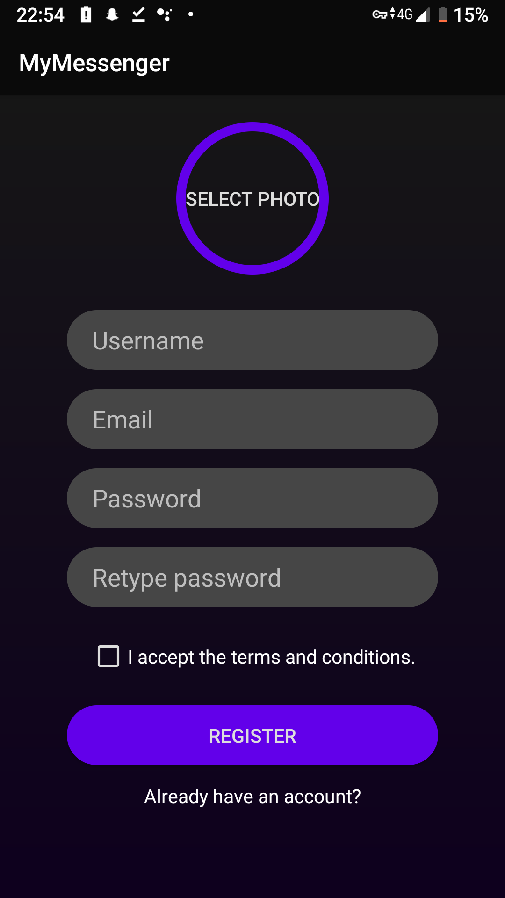
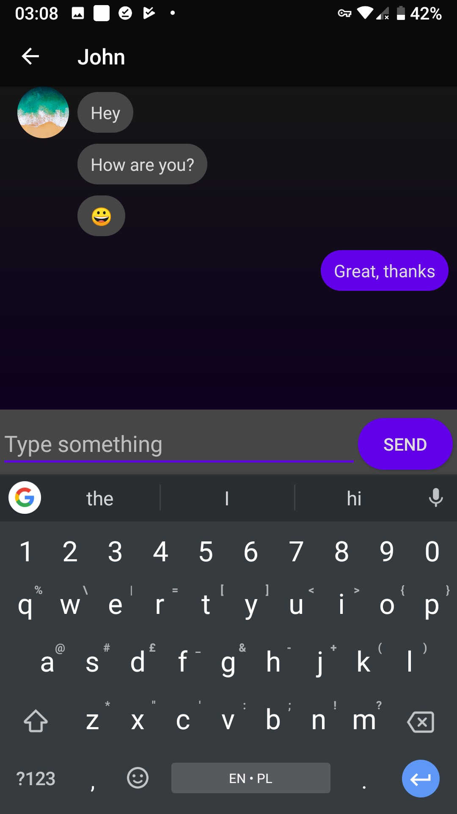

# MyMessenger

Messenger written in Kotlin, using Firebase Authentication and Database

## Screenshots

[APK](https://github.com/kzsobolewski/MyMessenger/raw/master/app/release/app-release.apk)
      
